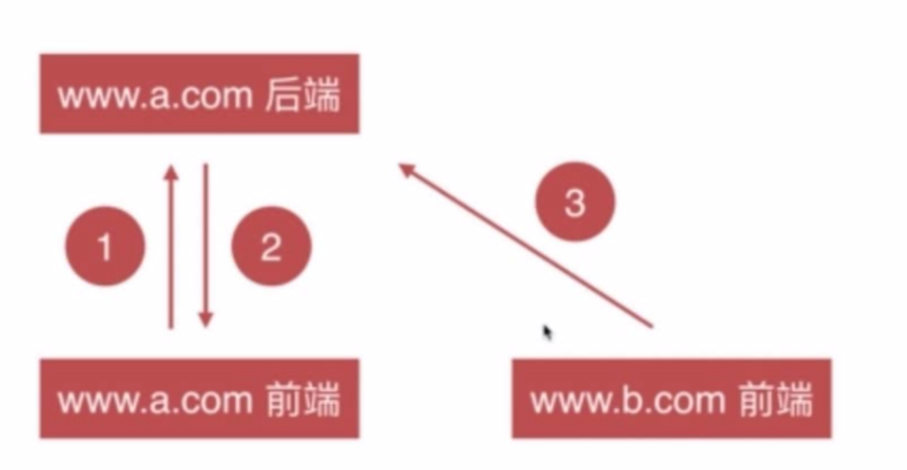
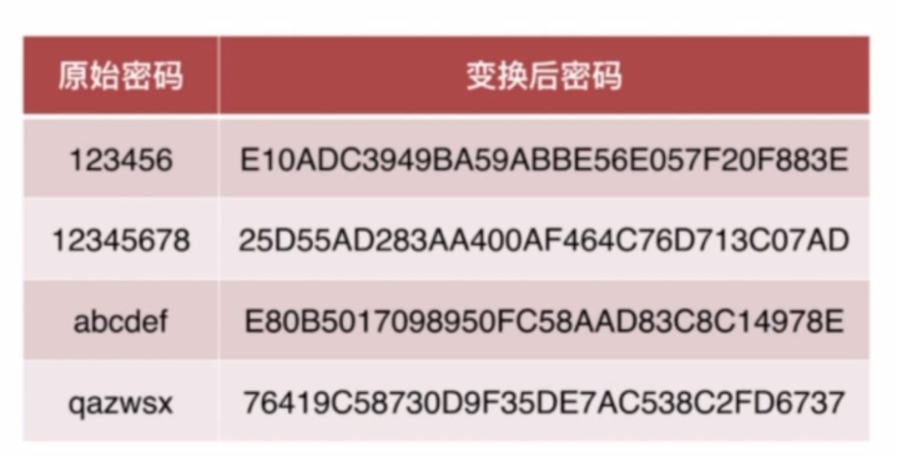
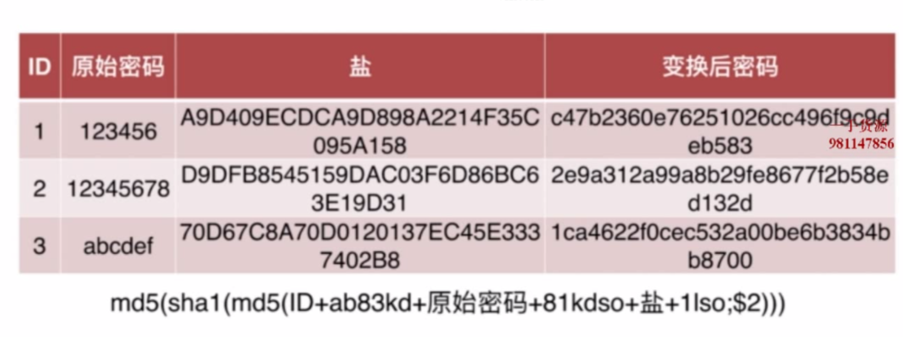

# 学习关于安全方面的前端知识

[TOC]

[课程来源](https://coding.imooc.com/class/chapter/104.html#Anchor)
[crypto涉及到的一些加密算法](https://www.liaoxuefeng.com/wiki/1022910821149312/1023025778520640)

## 环境搭建

#### 安装mysql

安装community版本，这个版本免费
[最终下载地址](https://dev.mysql.com/downloads/file/?id=484914),记得选择不要登陆下载
root Chenji336.

[简单安装](https://www.rigerwu.com/2018/04/23/Mac%20MySQL%20%E5%AE%89%E8%A3%85%E6%8C%87%E5%8D%97/)

mysql在系统偏好里面可以看到（或则全局搜索mysql）

**执行命令**：
1. /usr/local/mysql-8.0.15-macos10.14-x86_64/bin/mysql -uroot -p然后输入密码
  - u 跟  root 不能有空格
  - 把bin文件放到了.zsh中，所以全局使用mysql
2. 进入mysql命令之后，可以取消密码 ALTER USER 'root'@'localhost' IDENTIFIED BY '';之后进入就可以 mysql -uroot
3. 进入mysql命令，show databases;(不要忘记分号)

**引入外部的sql进入**：
./mysql safety -uroot< /Users/liulei/Documents/GitHub/security/mk-project/safety.sql
导入的数据库.user 密码都是123456（后续因为加密密码，所以数据库看不出来）

**sql常用命令（进入mysql命令之后）**
show databases;
create database safety;
use safety; 切换数据库

show tables; // 查看数据里面的table
create table test(id int);
drop table test; 删除表
exit; 退出项目

#### 安装执行

1. npm i -g jspm
2. jspm install
3. npm install
如果报错可以在执行一遍看看

## 前端XSS

#### XSS介绍

XSS: Cross site scripting,跨站脚本攻击
> 本来应该叫做CSS，但是css常常代表样式，所以就改用X

本例子中：url的query中添加from参数，相应页面的header就会改变

XSS主要是通过加入script脚本获取到用户的cookie，然后就可以登陆进行一些欺骗操作了。可以在url中进行注入
我自己理解的防御：后台可以让前端获取不到cookie，httpOnly

攻击手段：
- 把带有script标签的url发给用户，如果用户点击了，就会被攻击（如果链接可疑，则使用短链）
- 插入一个js，js默认会生成一个img dom，img.src把带有cookie参数带给`攻击者服务器`

场景：
QQ空间进入到别人空间，然后发现自己就被盗号了

#### XSS攻击类型

两大类型

- 反射型：通过url参数直接注入，然后把url发送给受害者(如果直接给用户肯定看的出来，这个时候做成[短链](https://dwz.cn/))
- 注入型：存储到DB后读取时注入，比如评论里`添加xss攻击`

XSS攻击注入点：

- HTML节点内容，实例：
	- from=beijing
	- 评论区添加xss攻击
- HTML属性：src=`image/1" onerror="alert(1)`,中间这样添加就可以攻击（图片avatarId来自url参数）
- javascript代码：from=`beijing";alert(1);"`,默认都有开始和闭合的引号(from也是url参数)
- 富文本: 评论区添加富文本

XSS防御：

- 浏览器自带的会防御注入到`HTML节点和属性`的XSS攻击,**但是通过url注入到js代码的工具不会防御**(demo不会是因为关闭了X-XSS-Protection)
- 转译成`HTML实体`，[相应字符实体表](https://www.w3school.com.cn/html/html_entities.asp) `site.js查看具体内容`
  - HTML内容转译，只显示text内容，只需要 `< => $gt; > => $lt;`
  - HTML属性转译，主要是 单引号、双引号、空格
  - javascript代码转译：如果用的是属性转译js显示就有问题
  	- `"` => `\"`,`'` => `\'`,
  	- `\` => `\\`,情型：from=beijing\";alert(1);//"， `//`代表注释
  	- 终极解决方法： JSON.stringify(xxx)，这样外面就默认是带有双引号了
  - 富文本`过滤`: 需要保留一些html标签，所以不能转译，而是过滤
  	输入的时候进行过滤性能消耗比输出少，因为输入时候过滤只要进行一次）,不过为了演示，我们代码是在输出的地方进行了过滤
  	- 黑名单过滤（变种太多了，所以写的不一定完整，不推荐使用）`site.js查看具体内容`
  	- 白名单进行过滤

#### CSP

内容安全策略（content security policy)

http头字段来进行限制

## CSRF

跨站请求伪造（Cross-site request forgery)

攻击方式：诱惑用户点击第三方网站进入，然后发送 被攻击网站 请求（默认会携带cookie，所以以为是本人操作）

#### CSRF攻击原理、场景以及危害

不经过A网站的前端，直接在B网站就可以发送A网站请求，所以防御可以针对：不`经过A网站前端`这里做文章

场景：
- 因为点击了某些链接进入，发现自己莫名发了一个说说，别人点击你的说说在进入自己也会发，这就是上章说的`蠕虫攻击`
- 银行转账

#### CSRF防御-samesite

原理：设置之后，第三方链接不能携带cookie进入网站
缺点： 兼容性不好

演示的时候注意：~~不同端口对于cookie来说不算跨域，更准确来说是cookie不算域~~
- 如果后台set-cookie,portal不同也不会设置成功
- 如果前端设置了document.cookie,端口不同也可以共享

#### CSRF防御-验证码

原理：

1. 后端生成验证码并且记录
2. 发送生成的验证码图片给前端
3. 前端输入验证码，当作参数传给后端
4. 后端验证是否正确，错误则不返回数据

如何攻击：攻击者可以提供验证码让客户去输入，不过这样成本就增加了

#### CSRF防御-token

验证码缺点：客户每次都需要输入，还有可能输错，体验不好

原理：同验证码，只是每次都不需要客户自己输入了

#### CSRF防御-referer

验证发送请求的来源，通过 `request.headers.referer` 判断

## 前端cookies问题

#### cookies特性

后端设置： set-cookie
前端设置：
- 添加：document.cookie='k1=v1;k2=v2;',再次访问发现只有k1=v1
- 删除：document.cookie='k1=v1;expires:Tue Nov 05 2019 22:01:35 GMT+0800',时间设置小于当前就好

特性(观察 chrome-application-cookie 对应的属性）：

- host
- path: 不同路径下面有不同cookie
- secure： https才允许携带cookie
- http-only：document.cookie 获取不到
- expires：过期时间
  - session代表本次会话，关闭才会过期
  - 格式：new Date() GMT
- samesite: 相同的域名才能携带cookie

#### cookies作用

**登录用户凭证**

使用userId做为凭证

	缺点：明文，容易被串改，所以需要`加密`

	改进：userId+签名，通过node自带的模块 crypt 进行加密

使用sessionId

	注意点：需要把sessionId存放到外部文件或则`数据库`中，否则服务器重启之后，内存中的cookie就消失了（cookie不会，因为cookie可以来自http头）

#### cookie-安全策略

- 签名防篡改（userId + sign)
- 私有变化（加密） 也是本commit的主要内容
- http-only
- secure
- samesite

## 前端点击劫持问题

#### 点击劫持现象

点击劫持：我被抢匪劫持了，他们非要我点击这个按钮

如何做一个点击劫持页面

1. 评论区页面嵌入到了iframe中，iframe透明度0
2. iframe下面有一个诱惑点击的页面（或则图片），诱惑按钮跟iframe评论群按钮重叠
3. 点击 诱惑按钮 就相当于点击了 评论按钮

#### 防御劫持

js防御：

top.location != window.location 然后跳转到window.location
漏洞：劫持者可以设置 sandbox="allow-forms",只允许iframe执行form表单提交，其他的js不执行

http防御：

设置X-Frame-Options: DENY

## 传输安全

#### http窃听

客户端--中间传输装置(代理服务器-链路)--服务器，窃听就发生在中间传输装置中

traceroute 查看所有经过的链路

场景：
- 打开网页，运营商通知你网费快过期了，通知你交网费
- http页面被嵌入了运营商的流量球
- 页面嵌入广告

危害：用户名和密码等敏感信息都会被窃听

代理拦截(使用charles)：
- 替换文件：选中文件，右键 map local，**如果不奏效，清空缓存**
  作用：直接替换线上js，查看修改后的结果是否正确
- 改变request和response：右键 breakPoint,然后请求就会中断
  作用：测试不同参数的数据

#### https原理

在传输过程中加密链路中间层，到达目的之后进行解密

http+tls(ssl),tls比ssl添加了更多的特性，但是不做严格的区分
- tls：transform layer security
- ssl: secure socket layer

[CA详细介绍](https://www.cnblogs.com/handsomeBoys/p/6556336.html)
ca: Certificate Authority（证书授权）

#### https本地部署

通过openssl进行本地部署:
1. ~~openssl req -x509 -newkey rsa:2048 -nodes -sha256 -keyout localhost-privkey-new.pem -out localhost-cert-new.pem~~
   openssl req -x509 -newkey rsa:2048 -nodes -sha256 -config req.cnf -keyout localhost-privkey-secure.pem -out localhost-cert-secure.pem
   增加了`-config req.cnf`,配置了域名，否则浏览器一直提示不安全
2. 在server.js中绑定生成好的 密钥localhost-privkey-secure.pem 和 证书localhost-cert-secure.pem
   如果使用nginx配置参考 `/Users/liulei/Documents/GitHub/http/http-node/nginx.conf`
3. 打开keychain,添加localhost-cert-secure.pem，右键标明为信任
4. 打开charles窃听，发现https窃听不到（前提是本地没有信任了charles的证书）

#### https生产环境部署

实例解析：
- 访问 https://www.toobug.net/
- 打开chrome控制台-security,点击 View certificate,查看该网站是被哪个机构颁发的证书
- 打开appchain，查看是不是有相应的证书

上面网站使用的证书是 `DST Root CA X3` 下属机构 `Let's Encrypt Authority X3` 颁发的，这是个免费的机构，很nice
大家通过 https://www.sslforfree.com/ 就可以给自己的网站添加证书

手动部署：
1. 添加给出的文件，添加到服务器指定位置，证明了你是服务器拥有者
2. 通过`服务器域名+路径`访问刚刚添加的文件，可以访问证明成功
3. 下载需要的 证书 和 密钥
4. 剩下步骤参考本地部署

自动部署：通过给定的命令即可（命令有些参数需要自己修改）

## 密码安全

#### 密码作用

证明你是你 => 进行对比（签名、数字...)

#### 密码存储

存储起来才能进行对比

###### 密码-泄漏渠道

- 物理方面
	- 数据库被盗
	- 人员泄漏（比如数据卖给第三方）
- 技术方面
	- 窃听
	- 服务器被窃听
	- 撞库（A网站和B网站使用同一个密码）

###### 密码-防御

- 不能明文存储密码（比如数据库被盗，这样被盗者通过数据库也不知道真实的密码）
- 单向变化（防泄漏） `密文-明文 不能反推（概要当然是不能推出文章的）`
- 变化复杂度要求（防猜解）`多次加密 md5(md5(sha1(sha256(明文))))`
- 要求密码复杂度（防猜解） `防御彩虹表`
- 加盐（如果不要求你密码复杂度的话）(防猜解) `帮用户防御彩虹表`

###### 防御实例：

密码-哈希算法

- 明文-密文 一一对应（虽然可能有多个明文对应一个密文，不过生产环境这种概率很小）
  相当于从 `文章（明文）提取概要（密文）`
- 密文-明文 不能反推（概要当然是不能推出文章的）
- 雪崩效应（不能改变一个明文而密文也相应改变一个）
- 固定长度
- 常见算法 md5 sha1 sha256

md5单向变化(实例)

md5破解：彩虹表
虽然 密文-明文 不能反推，但是如果事先已经保存过相应的 明文-密文 对应的数据表，那么就可以通过查询得出明文，这就是我们说的彩虹表

防御彩虹表：如果密码足够复杂，那么就可以防御彩虹表（因为越复杂，保存起来要求就更麻烦）

> 可以不用用户输入那么复杂的密码吗？

可以，通过加盐，也就是说我们来帮助用户把`原先的密码变成复杂的明文，然后加密`

密码-变换（多次md5\sha1\sha256）次数越多越安全

- 加密成本几乎不变（不过可能会稍微慢一点）
- 防御彩虹表（数量太大，无法建立通用型）
- 解密成本增加N倍

#### 密码不安全案例

1. start mysql
2. mysql -uroot -pChenji336.
3. use safety;
4. select * from user;
5. 显示明文密码

案例：

- 微博
- csdn，这个是有承认的，不过也是说老用户的明文已经转密文，只是数据库没有保存而已

#### 密码加固

数据库加盐字段：ALTER TABLE `user` ADD COLUMN `salt` varchar(64) NULL DEFAULT '' AFTER `password`;

> user salt 和 password 这些字段修改的时候需要使用 `` ，使用引号会报错

1. 如果之前有salt，则直接比较加密后的是否正确
2. 如果之前没有salt，则添加salt和更新密码

#### 密码传输的安全性

如何防御：

- https传输
- 限制频率
- 前端密码加密意义有限
  - 缺点：客户拿到前端加密后的密码，一样可以发送给后端登录
	- 有意义的点
	  - 防止撞库：我拿到A网站的明文密码，有可能登录B网站，如果加密之后就不会
		- 防止猜解：如果拿到多个明文密码，有可能猜解出加密的算法

代码编写：

1. 还原数据库: `update user set salt = '', password='123456' where id = 1;`;
2. 前端安装js-md5: `jpm install -S npm:js-md5`
3. 前端md5加密
4. 后端
  - 如果salt为空，则先跟前端一样md5加密（相同的str），然后后端在加密一次
	- 如果salt不为空，则逻辑不变

#### 生物特征密码

种类：

- 指纹（唇纹）
- 声纹
- 虹膜（眼睛）
- 人脸

缺点：

- 私密性（容易泄漏，比如指纹）
- 碰撞性（如果我受伤了，那我人脸识别还是不是我）
- 唯一性（我密码泄漏了，但是不能更改）

